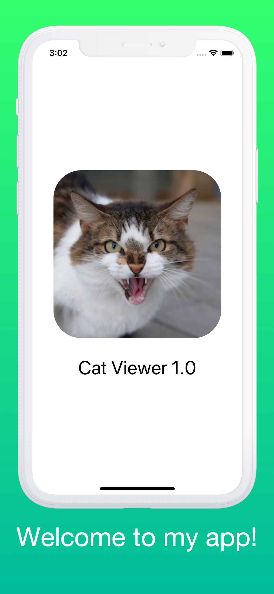

# SwiftFrame

  [](https://github.com/kayak/SwiftFrame/blob/master/LICENSE) [](https://github.com/kayak/SwiftFrame/issues)

SwiftFrame is a command line application for composing and laying out screenshots. Here's an example from the sample app.



## Installation

### [Mint](https://github.com/yonaskolb/mint)

The easiest way to get SwiftFrame is via Mint:

```
$ mint install kayak/SwiftFrame
```

### From Source

However, if you'd like you can also build SwiftFrame from source. To do this clone the repository and run the `install.sh` script. This will compile a binary and install it into `usr/local/bin/swiftframe`.

-   clone the repository (e.g. `git clone https://github.com/kayak/SwiftFrame`)
-   change into the directory: `cd SwiftFrame`
-   run the install script: `sh install.sh`

## Usage

To use SwiftFrame, you need to pass it a configuration file (which is a JSON or YAML file):

```bash
swiftframe path/to/your/config/file --verbose
```

### Available Options

#### --verbose

Prints additional information during processing and rendering. This will also ask you to confirm the processed config file before SwiftFrame starts rendering

#### --no-color-output

Disables colored output. Useful for CI logs for example

#### --no-manual-validation

Disables the manual validation that requires you to confirm the parsed config file by pressing a key. Only useful in combination with `--verbose`

You can also use the `--help` flag to print SwiftFrame's documentation out

## Configuration File

The format of the configuration file is specified as following (indent levels represent nesting levels within the file):

-   `stringsPath`: a path to a folder with `.strings` files, prefixed with the corresponding locale (e.g. `en.strings`)
-   `maxFontSize`: the maximum font point size to use. SwiftFrame will be always try to render the text at the largest point size that fits within the bounding rectangle. If the determined point size is larger than `maxFontSize`, the latter will be used
-   `outputPaths`: an array of paths to where SwiftFrame should output the finished screenshots. This is an array in case you want to render the files into multiple directories at the same time. (Note: screenshots will be placed into subfolders organized by locale within these paths)
-   `fontFile`: a path to a font file
-   `format`: the output format of the screenshots, can be `png`, `jpeg` or `jpg`
-   `textColor`: a RGB color in Hex format (e.g. `#FFF`) to use for titles
-   `outputWholeImage`: **optional (default: false)** a boolean telling the application whether or not to also output the whole image instead of just the sliced up screenshots
-   `clearDirectories`: **optional (default: true)** a boolean telling the application whether or not to clear the specified output directories before writing new files to it. This prevents random screenshots from being used in case you update your template file to include one less screenshot for example
-   `locales`: **optional** a regular expression that can be used to exclude (or include) certain locales during rendering. To only include `fr` and `de` locale for example, use `"fr|de"`. To exclude `ru` and `fr`, use something like `"^(?!ru|fr$)\\w*$"`
-   `deviceData`: an array containing device specific data about screenshot and text coordinates (this way you can frame screenshots for more than one device per config file)
    -   `outputSuffixes`: an array of suffixes to apply to the output files in addition to the locale identifier and index. Multiple suffixes can be used to render the same screenshots for different target devices (for example 2nd and 3rd 12.9 inch iPad Pro)
    -   `screenshots`: a folder path containing a subfolder for each locale, which in turn contains all the screenshots for that device
    -   `templateFile`: an image file that will be rendered above the screenshots to overlay device frames (e.g. see `Example/Template Files/iPhone X/TemplateFile.png`) **Note:** places where screenshots should go need to be transparent
    -   `sliceSizeOverride`: **optional** A custom slice size override in cases where you want to use different size screenshots (for example iPhone X screenshots with a iPhone 8 template file)
        -   `width`: The width of the custom slice size
        -   `height`: The height of the custom slice size
    -   `gapWidth`: **optional (default: 0)** a gap width in pixels that will be skipped after every screenshot that is sliced from the template file
    -   `screenshotData`: an array containing further information about screenshot coordinates
        -   `screenshotName`: the file name (just name, not path) to the screenshot file to render
        -   `zIndex`: **optional**, use this to avoid wrong rendering order if two screenshots need to overlap each other for example
        -   `bottomLeft`, `bottomRight`, `topLeft` and `topRight`: the corners of the screenshot to render. Note that screenshots can be rotated in 3D, so the corners of the resulting don't have to form 90 degree angles
            -   `x`: The x coordinate of the corner point, relative to the left edge
            -   `y`: the y coordinate of the corner point, relative to the top or bottom edge
    -   `textData`: an array containing further information about text titles coordinates and its layout
        -   `identifier`: the key that SwiftFrame should look for in the `.strings` file for a certain title
        -   `colorOverride`: **optional**, a color in Hex format to use specifically for this title
        -   `alignment`: information about text alignment
            -   `horizontal`: the horizontal text alignment in CSS style (`left`, `right`, `center`, `justify` or `natural`)
            -   `vertical`: the vertical text alignment in (`top`, `center`, `bottom`)
        -   `customFontPath`: **optional**, a path to a font file to use specifically for this title
        -   `groupIdentifier`: **optional**, an identifier for a text group (see below)
        -   `topLeft` and `bottomRight`: the bounding coordinate points of the text (as of right now, it's not possible to have rotated text)
            -   `x`: The x coordinate of the corner point, relative to the left edge
            -   `y`: the y coordinate of the corner point, relative to the top or bottom edge
-   `textGroups`: **optional**, an array of text groups which you can use to force multiple titles to use the same font size
    -   `identifier`: the identifier of the text group
    -   `maxFontSize`: the maximum font point size titles with this group ID should be using (overrides the global `maxFontSize`)

## Example

To run the example, either install the CLI (see above) and run `swiftframe Example/example.config --verbose` or directly via `swift run swiftframe Example/example.config --verbose`

## Scaffolding

SwiftFrame also provides a subcommand to quickly setup the folder structure needed to get started with SwiftFrame. To scaffold, use the following command:

```
swiftframe scaffold "en" "de" --path path/of/your/desired/swiftframe/scaffold
```

After the subcommand `scaffold` you specify all the locales that you want to create folders/files for. After that you need to specify the path where you want the scaffold to be created.

### Available Options

#### --lowercased-directories

This flag will create directories with lowercased names

#### --no-helper-files

With this flag SwiftFrame will not create sample files for each locale/device. Otherwise a sample `.strings` file and some `README.md` files will be written in the folders to help you get started

#### --verbose

Will print some additional information, for example how many folders and files were created

## Notes

We offer rudimentary markup support for your strings with HTML tags such as \<b>, \<i> or \<u>. In order to use this, please make sure the font file you pass in uses the .ttc format, is installed on your computer and has all the versions you need.

## Why not frameit?

Fastlane's [frameit](https://github.com/fastlane/fastlane/tree/master/frameit) is an awesome tool but we have, unfortunately, found it to be too limitting for our own needs. At the time of writing this, the following reasons drove us towards implementing a stand-alone solution:

-   No 3D placement of screenshots or support for multiple titles/screenshot in one framed image
-   Long titles could not properly be forced onto more than one line in frameit. The font size just shrinks until the text fits onto a single line which usually produces small text and different font sizes for every screenshot.
-   Due to the multitude of brands and locales that we support, we had to offload frameit to our build server since running it locally and on demand turned out to be too slow.
-   The fact that frameit was built on top of imagemagick seemingly made it hard to easily address any of the above with a pull request.
